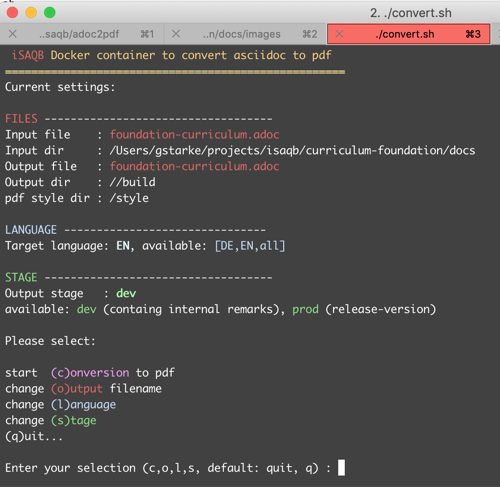

# Docker based conversion from AsciiDoc to PDF for iSAQB curricula

## Native transformation using asciidoc-pdf

We convert from asciidoc to pdf using the [AsciiDoctor-PDF](https://asciidoctor.org/docs/asciidoctor-pdf) utility, embedded into a Docker container.

As a prerequisite, you need to build the container.

    ./buid-container.sh

## Usage

You have two options - one with some interactivity
### command-line configuration: adoc2pdf.sh
Call the `adoc2pdf.sh` script from the command line with the input filename (full path) as parameter, for example:

    $./adoc2pdf.sh /Users/gstarke/projects/isaqb/foundation/curriculum-foundation.adoc

### interactive configuration: convert.sh
Call the `convert.sh` script from the command line with

    $./convert.sh /Users/gstarke/projects/isaqb/foundation/curriculum-foundation.adoc

This will start an interactive shell in the container, giving you several additional options to configure, see figure below:

## How it works

The main script is `configure-and-convert-in-container.sh`, which is located in `./assets`. That script is copied into the Docker container during the build process and is its `ENTRYPOINT`.

1. At first you need to build the container. There's a `build-container.sh` script prepared for you.
2. You have two options to convert asciidoc files (see above). The `convert.sh` (see above) gives you some flexibility without forcing you to edit script files.
3. Both scripts `run` the Docker container, mapping several local directories to paths within the container:
    * `/build` is where the output of the conversion is written
    * `/style` is where the pdf theme is located. 
    * `/documents` is where asciidoctor-pdf expects your asciidoc input file 
4. During the conversion, the output pdf is created in `/build`.
      

## PDF Styling

We customized a theme mimicking the original iSAQB documents (minus special fonts).

See the [AsciiDoctor pdf guide](https://github.com/asciidoctor/asciidoctor-pdf/blob/master/docs/theming-guide.adoc) for extensive documentation on styling options.

For conversion to pdf we use our custom pdf theme, named *isaqb-theme.yml*. This theme is located in:

    ./style

## Requirements

The scripts and container are tailored around some specific requirements:

* convert documents written in several (at least EN and DE) languages
* distinguish between _development_ (dev) and _production_ (prod) versions of the target documents: _dev_ versions need to contain comments and remarks, which are contained within the asciidoc source documents.

## License and Copyright

This work has been initiated by the _Foundation Level Working Group_ of the [iSAQB e.V.](https://isaqb.org),
a non-profit organization to advance the area of software architecture.

Initially created by Peter Götz and Gernot Starke.

